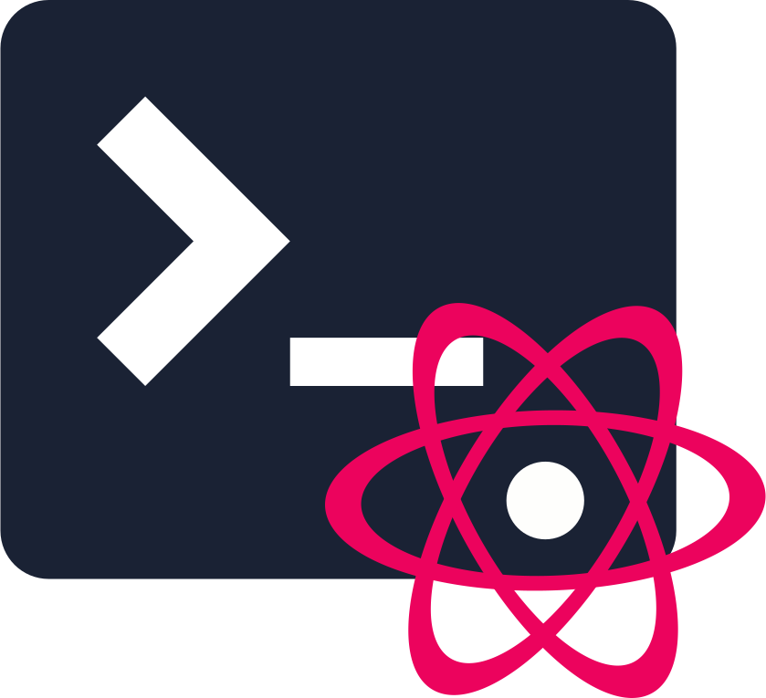

 

# Proton CLI
A Python script for making your current installed Proton able to use in a terminal. Often used for debugging, running non-Steam games and more 

# Features
* Necessary enviorments to make Proton able to run in Terminal 
* Discord RPC support. It will ask during installation.
* Can switch Proton version.

# Setting up
Step 1: Clone this repository using `git clone https://github.com/raluvy95/proton-cli` 
Step 2: Open in terminal and run `./install` 
Step 3 (optional): To update the script, go to the repository you cloned, then `git pull` and then use `./install copy`

# Troubleshooting
Open a new issue related about this and we will try to fix.

# Acknowledgements
* [Simple-term-menu](https://github.com/IngoMeyer441/simple-term-menu) - Used for selecting Proton version
* [wine discord ipc bridge](https://github.com/0e4ef622/wine-discord-ipc-bridge) - Used to make RPC working with wine/proton.

# Notes
This project is only used for my personal purpose. I don't expect this to support Steam Deck and others like that. Would be really awesome if you open new pull request for new feature and bug fixes!